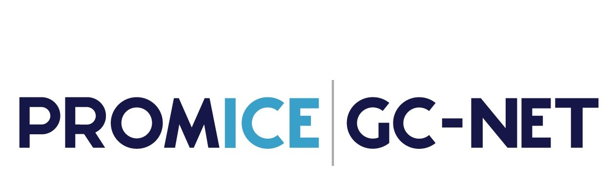

<h1 style="font-size:20px">

<strong>
The SUMup dataset
 
Surface characteristics and mass balance observations from the Greenland and Antarctic ice sheets

</strong>
</h1> 

## Repositories available:
- [Processing script and raw dara (private, only for maintainers)](https://github.com/SUMup-database/SUMup-2023)
- [Example scripts to us the SUMup 2023 files](https://github.com/SUMup-database/SUMup-example-scripts)
- [Forum for data suggestion and issue reports](https://github.com/SUMup-database/SUMup-data-suggestion/issues)

